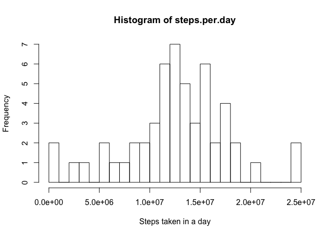
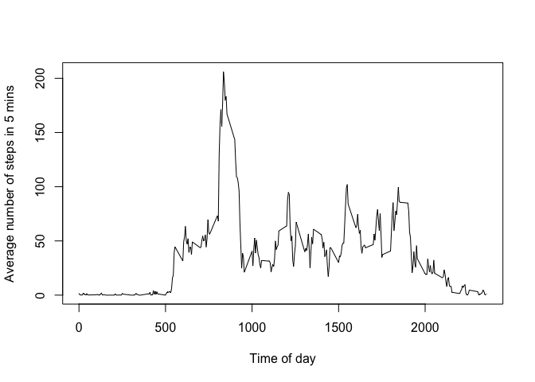
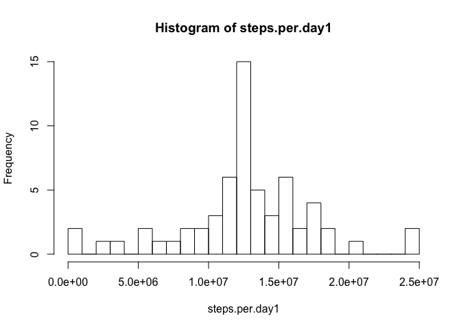
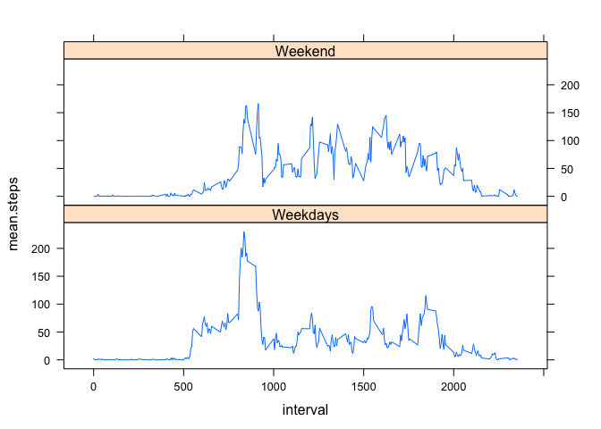

# Reproducible Research: Peer Assessment 1

## Loading and preprocessing the data

```r
data<-read.csv("activity.csv")
head(data)
```

```
##   steps       date interval
## 1    NA 2012-10-01        0
## 2    NA 2012-10-01        5
## 3    NA 2012-10-01       10
## 4    NA 2012-10-01       15
## 5    NA 2012-10-01       20
## 6    NA 2012-10-01       25
```

```r
dim(data)
```

```
## [1] 17568     3
```

```r
str(data)
```

```
## 'data.frame':	17568 obs. of  3 variables:
##  $ steps   : int  NA NA NA NA NA NA NA NA NA NA ...
##  $ date    : Factor w/ 61 levels "2012-10-01","2012-10-02",..: 1 1 1 1 1 1 1 1 1 1 ...
##  $ interval: int  0 5 10 15 20 25 30 35 40 45 ...
```

```r
summary(data$interval)
```

```
##    Min. 1st Qu.  Median    Mean 3rd Qu.    Max. 
##     0.0   588.8  1178.0  1178.0  1766.0  2355.0
```

```r
data$date<-as.Date(data$date)
summary(data$date)
```

```
##         Min.      1st Qu.       Median         Mean      3rd Qu. 
## "2012-10-01" "2012-10-16" "2012-10-31" "2012-10-31" "2012-11-15" 
##         Max. 
## "2012-11-30"
```

```r
class(data$date)
```

```
## [1] "Date"
```

## What is mean total number of steps taken per day?
The following code will respond to the question "What is mean total number of steps taken per day?"
But first, let's calculate the number of steps per day...

```r
steps1<-aggregate(data$steps~data$date,FUN=mean)
# Number of intervals recorded in a single day
data$dummy<-rep(1,nrow(data))
# Confirm number of intervals in a day
interval1<-aggregate(data$interval~data$date,FUN=sum)
unique(interval1[,2]) # The number of intervals is the same for each day in the datset
```

```
## [1] 339120
```

```r
steps.per.day<-unique(interval1[,2])*steps1[,2]
```
Now, a histogram of the number of steps taken per day

```r
hist(steps.per.day,breaks=20,xlab="Steps taken in a day")
```

 

... and the mean and median of the number of steps per day

```r
mean(steps.per.day)
```

```
## [1] 12677187
```

```r
median(steps.per.day)
```

```
## [1] 12675788
```

## What is the average daily activity pattern?
Now, let's look at the daily activity pattern

```r
dap<-aggregate(data$steps~data$interval,FUN=mean)
plot(dap[,1],dap[,2],type="l",xlab="Time of day",ylab="Average number of steps in 5 mins")
```

 
And the time of the day that records the maximum number of steps is

```r
dap[which.max(dap[,2]),1]
```

```
## [1] 835
```

## Imputing missing values
First, number of missing values

```r
miss<-which(is.na(data$steps))
length(miss)
```

```
## [1] 2304
```
Second, create copy of dataset and imput missing steps values into it

```r
data1<-data
for(i in miss){
  data1$steps[i]<-dap[which(dap[,1]==data1$interval[i]),2]
}
```
... and get historgram of number of steps taken per day and summary statistics

```r
# Create table with number of steps taken per day with dataset with filled-in missing values
steps1.1<-aggregate(data1$steps~data1$date,FUN=mean)
steps.per.day1<-mean(interval1[,2])*steps1.1[,2]
hist(steps.per.day1,breaks=20)
```

 

```r
mean(steps.per.day1)
```

```
## [1] 12677187
```

```r
median(steps.per.day1)
```

```
## [1] 12677187
```
The mean and the median are now the same, after inputing step missing values with the mean of the interval where the missing values were.

## Are there differences in activity patterns between weekdays and weekends?
Now, let's see if there are differences between weekdays and weekends

```r
# Create factor of weekday or weekend on data with filled-in values
dap1<-aggregate(data1$steps~data1$interval,FUN=mean)
data1$weekdy<-rep("Weekday",nrow(data1))
data1$weekdy[which(weekdays(data1$date)=="Sunday"|weekdays(data1$date)=="Saturday")]<-"Weekend"

#Compute mean for each interval, depending on whether this is a weekday or weekend day
dow<-subset(data1,weekdy=="Weekday")
wknd<-subset(data1,weekdy=="Weekend")
dow1<-as.data.frame(aggregate(steps~interval,FUN=mean,data=dow))
wknd1<-as.data.frame(aggregate(steps~interval,FUN=mean,data=wknd))
names(dow1)<-c("interval","mean.steps")
dow1$weekdy<-"Weekdays"
names(wknd1)<-c("interval","mean.steps")
wknd1$weekdy<-"Weekend"
#Combine weekday and weekend dataframes
int.steps<-rbind(dow1,wknd1)
```

 
